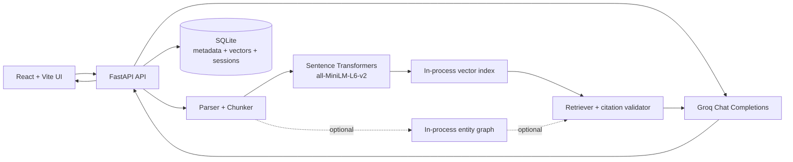

# Local Hobby RAG Architecture

This project is intentionally a single-user, local-first document assistant. It
does not require Docker, Redis, Neo4j, PostgreSQL, Qdrant, MinIO, or a separate
worker service.

## Request flows

### Upload and indexing

1. The browser uploads a supported file to FastAPI.
2. The backend stores the original under `uploads/` and creates a processing job.
3. The parser extracts text and page metadata. Image-only PDFs fail clearly
   because OCR is intentionally out of scope for this hobby version.
4. The chunker creates overlapping, page-aware chunks.
5. Sentence Transformers creates local embeddings. The first run downloads the
   configured open model; subsequent runs use the local cache.
6. SQLite stores document metadata, chunks, vectors, and processing state.

Entity and relationship extraction is an optional enrichment path controlled by
`ENABLE_KNOWLEDGE_GRAPH=true`. It is off by default so arbitrary PDFs do not
depend on brittle domain-specific entity rules.

### Question answering

1. The query is classified and planned.
2. The local vector index retrieves the most relevant chunks using query/document
   embeddings and lightweight lexical boosting.
3. Optional graph evidence is added only when graph enrichment is enabled and
   matching graph data exists.
4. The evidence is sent to Groq with instructions to treat document text as
   untrusted data and to cite only supplied evidence.
5. The citation validator rejects citations for chunks that were not retrieved,
   normalizes snippets from the retrieved chunk, and records validation issues.
6. The answer, citations, retrieval trace, and runtime counters are persisted.

## Why each dependency exists

| Component | Purpose | Why it is local/simple |
| --- | --- | --- |
| React + Vite | Upload, search, chat, and document inspection UI | One browser app; no server-side frontend deployment |
| FastAPI + Uvicorn | HTTP API and background upload processing | Small Python service with automatic API docs |
| pypdf / python-docx / BeautifulSoup | Parse common document formats | No external parsing service |
| Sentence Transformers | Free local semantic embeddings | No embedding API key or vector database required |
| SQLite | Durable single-user persistence | One file, built into Python, easy to reset |
| In-process vector index | Similarity search over local vectors | Appropriate for a hobby-scale corpus |
| Groq | LLM answer generation only | One explicitly configured external provider |
| Optional graph modules | Explainable entity/relationship enrichment | Disabled unless the user wants that feature |

## Deliberate non-goals

- Multi-user authentication and permissions
- Distributed workers, queues, or horizontal scaling
- OCR for scanned/image-only documents
- Cloud storage and deployment infrastructure
- A full evaluation harness or curated benchmark corpus

If the project later grows beyond a local hobby corpus, the first replacement
points are the in-process vector index and SQLite persistence—not the user
interface or provider boundary.
