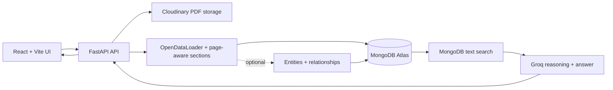

# InsightGraph Vectorless Architecture

## Upload flow

1. The browser uploads a file to FastAPI.
2. FastAPI stores the original in Cloudinary and keeps only a temporary local
   copy while processing.
3. OpenDataLoader extracts structured PDF JSON/Markdown with page numbers,
   headings, element types, and bounding boxes. Image-only PDFs use the
   bounded OCR fallback when OpenDataLoader local mode has no text.
4. The section builder creates page-aware text chunks. These are plain text
   units, not embedding vectors.
5. MongoDB stores the document, chunks, processing job, and optional graph
   records.
6. The temporary local copy is removed after indexing.

## Question flow

1. The user sends a question to `/api/chat`.
2. MongoDB text indexes search headings, paragraphs, chunk text, and entity
   names.
3. The backend assembles the best matching sections and optional graph facts.
4. Groq receives only that evidence and is instructed to cite supplied sources.
5. Citation validation removes references to sections that were not retrieved.
6. The answer, citations, trace, and session are stored in MongoDB.

## Why each dependency exists

| Component | Purpose |
| --- | --- |
| React + Vite | Browser interface |
| FastAPI + Uvicorn | HTTP API and upload processing |
| OpenDataLoader PDF / python-docx / BeautifulSoup | Structured document parsing |
| Cloudinary | Durable original-file storage |
| MongoDB Atlas | Durable application and text-section storage |
| MongoDB text index | Vectorless lexical retrieval |
| Groq | Evidence-based reasoning and answer generation |
| Optional graph modules | Entity and relationship enrichment |

No PageIndex, embeddings, vector store, SQLite database, Redis, Neo4j, or
separate vector database is required.
